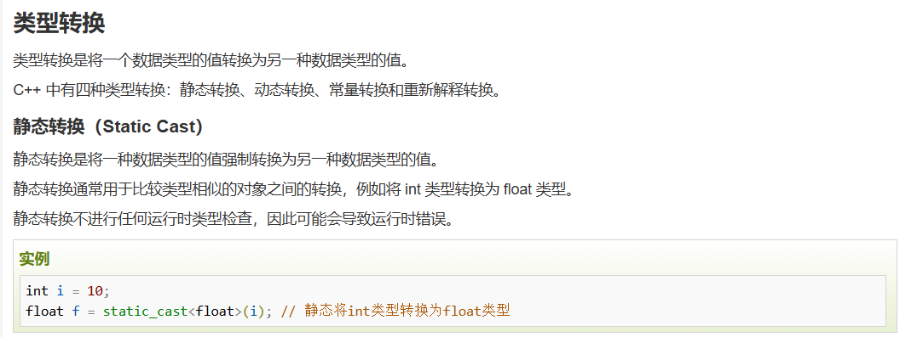
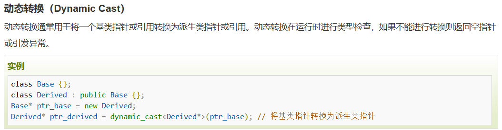
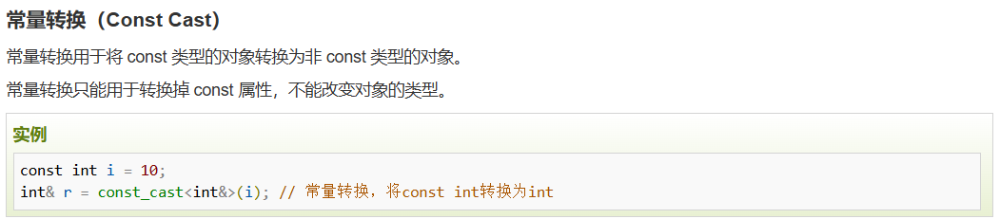
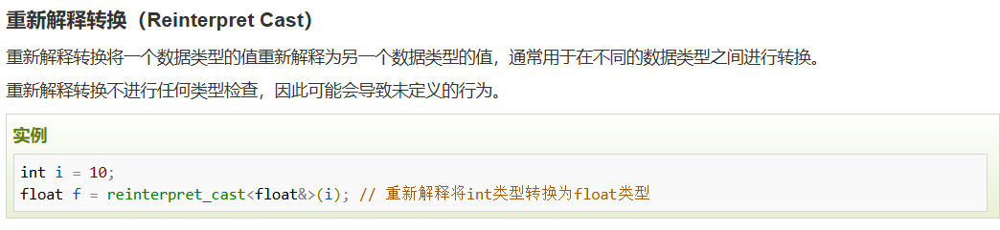
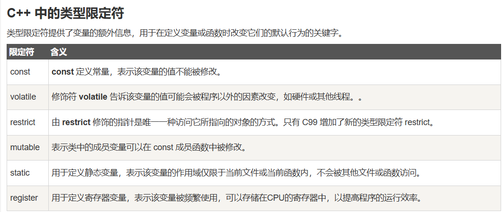

# C++基本语法
## 四种定义
- 对象：对象具有状态和行为。例如：一只狗的状态 - 颜色、名称、品种，行为 - 摇动、叫唤、吃。对象是类的实例。
- 类：类可以定义为描述对象行为/状态的模板/蓝图。
- 方法：从基本上说，一个方法表示一种行为。一个类可以包含多个方法。可以在方法中写入逻辑、操作数据以及执行所有的动作。
- 即时变量：每个对象都有其独特的即时变量。对象的状态是由这些即时变量的值创建的。

## 数据类型
数据类型[web](https://www.runoob.com/cplusplus/cpp-data-types.html)
### typedef 声明
- typedef 声明：typedef 关键字允许您为类型取一个新的名字。
- 语法：
```cpp
typedef type newname; 
typedef int feet;
feet distance;//完全等价于int distance;
```

### 枚举类型
- 枚举类型：枚举类型是用户定义的整数类型。枚举类型可以用来定义一组命名的整常量。
```cpp
enum 枚举名{ 
     标识符[=整型常数], 
     标识符[=整型常数], 
... 
    标识符[=整型常数]
} 枚举变量;
    
enum color { red, green, blue } c;
c = blue;//这时候枚举类型c的值就是3

enum color { red, green=5, blue };
//这里blue的值就是6，默认比前一值大1
```
## 类型转换
### 静态类型转换
静态类型转换，将一个数据类型转换为另一种，**不进行类型转换检查**
通常用于比较相似类型之间转换，**如int转换为float**

### 动态类型转换
用于将一个基类指针转换为派生类指针，**进行类型转换检查**，*基类* 指针

### const 常量转换
用于将const类型的对象转换为非const类型的对象
只能转换掉const属性，不能改变对象类型

### 重新解释转换


## 变量类型
### union
### 类

## c++ 修饰符
### c++中的类型修饰符

1.  - const 修饰符：const 修饰符用于定义常量，只能被赋值一次。
    - 修饰符的顺序：const 修饰符一般放在类型修饰符的前面，const 修饰符一般放在变量名前面。
    - ```cpp
        const int NUM = 10; // 定义常量 NUM，其值不可修改
        const int* ptr = &NUM; // 定义指向常量的指针，指针所指的值不可修改
        int const* ptr2 = &NUM; // 和上面一行等价
    ```
    - 详见const小结


## string类库

string 是一个模板类，其定义在头文件 string 中。
```cpp
    #include <iostream>
    #include <string>
     
    using namespace std;
     
    int main ()
    {
       string str1 = "runoob";
       string str2 = "google";
       string str3;
       int  len ;
     
       // 复制 str1 到 str3
       str3 = str1;
       cout << "str3 : " << str3 << endl;
     
       // 连接 str1 和 str2
       str3 = str1 + str2;
       cout << "str1 + str2 : " << str3 << endl;
     
       // 连接后，str3 的总长度
       len = str3.size();
       cout << "str3.size() :  " << len << endl;
     
       return 0;
    }
```
```
以上代码运行后，将产生以下结果：

```cpp
    str3 : runoob
    str1 + str2 : runoobgoogle
    str3.size() :  12
```
```
```
## 引用和指针
1. 通过*ptr访问指针指向的变量
2. 引用和指针

### 引用
- 引用变量是一个**别名**，也就是说，它是某个已存在变量的另一个名字。一旦把引用初始化为某个变量，就可以使用**该引用名称**或**变量名称**来**指向**变量。
- 引用和指针的区别：
  1. 不存在空引用。引用必须连接到一块合法的内存。
  2. 引用一旦被初始化，就不能指向其他对象。指针可以改变指向不同的对象。
  3. 引用必须在创建时被初始化。指针可以在任何时候被初始化。
- C++ 中创建引用
  1. 变量名称是变量**附属在内存位置中的标签**，可以把引用当成是变量附属在内存位置中的**第二个标签。** 
  - ```cpp
  int a = 10;
  int &b = a;
  ```
    ```
  - 上述代码中，变量 a 和变量 b 指向同一个内存位置。& 读作引用。可以解释为 b 是初始化为a的整型引用。
  - 可以使用b直接访问a
  ```cpp
  #include <iostream>
    using namespace std;
     
    int main ()
    {
       // 声明简单的变量
       int    i;
       double d;
     
       // 声明引用变量
       int&    r = i;
       double& s = d;
       
       i = 5;
       cout << "Value of i : " << i << endl;
       cout << "Value of i reference : " << r  << endl;
     
       d = 11.7;
       cout << "Value of d : " << d << endl;
       cout << "Value of d reference : " << s  << endl;
       
       return 0;
    }
    ```
  - 上述代码运行后，将产生以下结果：
    ```cpp
        Value of i : 5
        Value of i reference : 5
        Value of d : 11.7
        Value of d reference : 11.7
    ```

  - 引用变量是**指针的别名**，所以引用变量和指针具有相同的内存占用。 
  
  