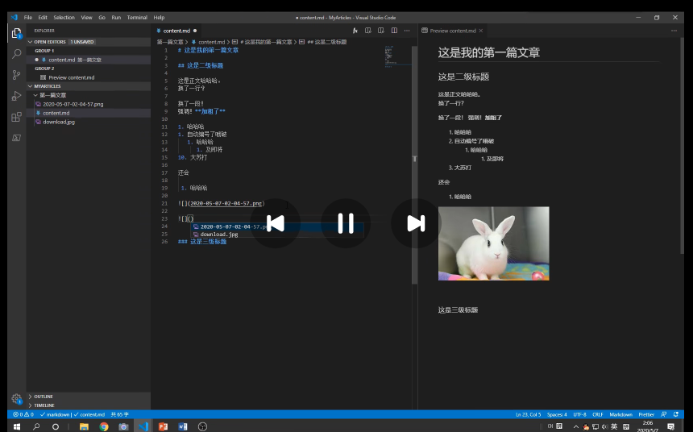

# This is the first level title
## the second level title

this is 正文
回车可换行

## 斜体与加粗
这是**加粗**ctrl b是加粗 **加粗**，但是加粗和斜体的快捷键在一个大范围中囊括
这是*斜体*，其中ctrl i是 *斜体*

## 列表
1. 一
2. 二
   1. 自动补全
   2. 乱编也行
3.  确实

+ 无序列表
+ 2
+ 3
  
## 图片
ctrl alt +v 快捷键

很厉害

## 插入一个公式

latex公式

$$
\lim_{x \to \infin}\frac{{sin(t)}}x-1
$$

快捷键：
文中的插入公式，ctrl + m$$
连按两次
$$

$$

## 表格

| 小明 | 大明  | 姚明 |
| ---- | :---: | ---- |
| 1.3  |  32   | 2    |

alt + shift + f
格式化
冒号表示对齐方向

## 插入链接
[百度](https://www.baidu.com)
按下ctrl + v复制链接
[百度](https://www.baidu.com"tittle=百度")

## 添加代码块
添加三个左上角小点，指定语言并复制即可
```c++
int a = 10;
int b = 3;
class Solution {
public:
    vector<int> twoSum(vector<int>& nums, int target) {
        unordered_map<int,int>hashtable;
        for(int i=0;i<nums.size();i++){
            auto it = hashtable.find(target-nums[i]);
            if(it!=hashtable.end()){
                return {it->second,i};
            }
            hashtable[nums[i]]=i;
        }
        return {};
    }
};
```

## 右键导出pdf


